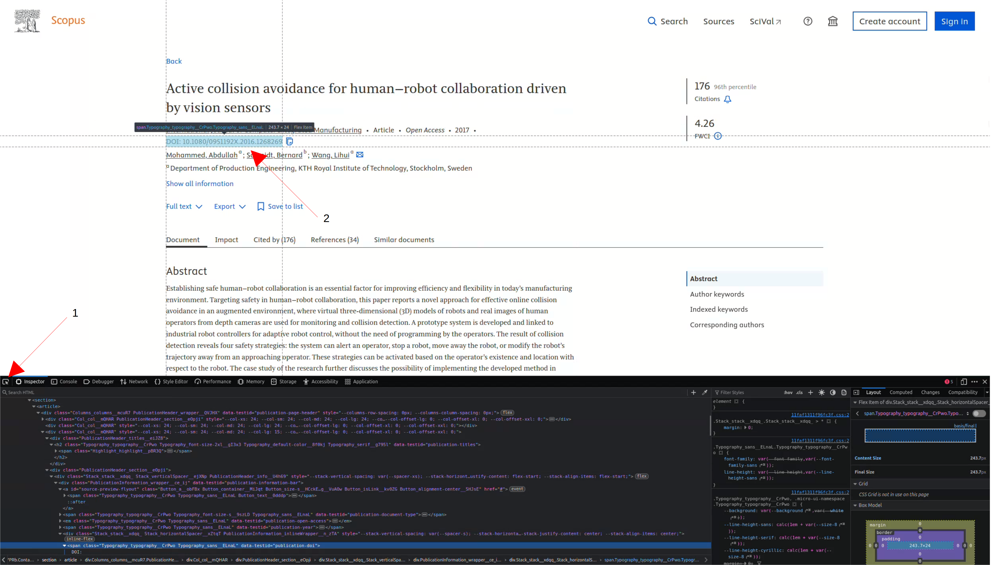
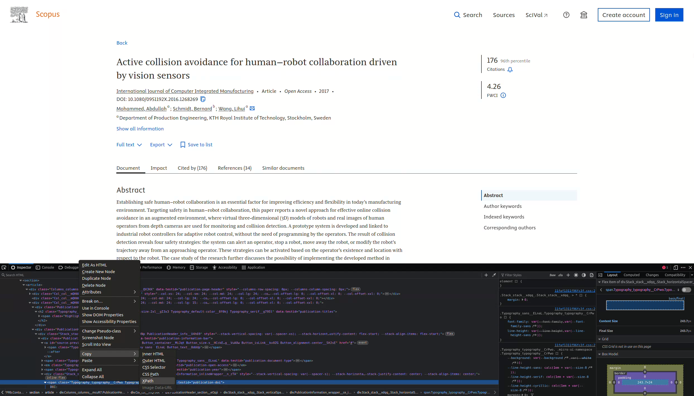

# Parser

The parser is responsible for extracting structured information from HTML pages. The primary goal of the project is to identify scholarly articles and determine both the articles they cite and the articles that cite them.
The core data model is an Article, which represents a single publication and contains the following fields:

- id: site-specific identifier of the article
- title: title of the article
- pdf: direct link to the article PDF, if available
- year: year of publication
- num_citing: number of articles that cite this article
- num_cited: number of articles cited by this article
- citing: list of known articles that cite this article
- cited: list of known articles referenced by this article
- explored: flag indicating whether all available information for this article has been extracted

---

## Core Methods

### load_from_page

The primary method to implement is `load_from_page`. It receives a section of a html page and populates the fields of the Article instance from it.

### extract_elements

The `extract_elements` function is responsible for locating article entries within a page and instantiating corresponding Article objects.

Some pages (e.g. result listings or reference sections) contain multiple article entries, `extract_elements` is responsible to identify the relevant DOM segments for each article, creates an Article instance for each one, and invokes `load_from_page` on the corresponding DOM node.

Because parser modules are defined per site, and a single site may expose multiple endpoints with distinct DOM structures, extract_elements also receives the page path. This allows it to dispatch to different extraction strategies depending on the endpoint being processed.

## Examples

```py
class MyArticle(Article):
    def load_from_page(self, page: html.HtmlElement) -> bool:
        tile_section = page.xpath("/html/body/div/div/main/div/section/article/div[1]/div[3]/div[1]/h2/span")[0]
        self.title = tile_section.text_content()

        doi_section = page.xpath("/html/body/div/div/main/div/section/article/div[1]/div[3]/div[2]/div/div/div/span")[0]
        doi_string = doi_section.text_content()
        #'DOI: 10.1080/0951192X.2016.1268269'
        assert doi_string.startswith("DOI: ")
        self.doi = re.search(r'DOI: (\S+)', doi_string, re.IGNORECASE).group(1)

        year_section = page.xpath("/html/body/div/div/main/div/section/article/div[1]/div[3]/div[2]/div/div/span[2]")[0]
        self.year = int(year_section.text_content())
        
        citing_section = page.xpath("/html/body/div/div/main/div/section/article/div[2]/div/div/div[1]/button[3]/span")[0]
        citing_string = citing_section.text_content()
        self.num_citing = int(re.search(r'\((\S+)\)', citing_string, re.IGNORECASE).group(1))

        cited_section = page.xpath("/html/body/div/div/main/div/section/article/div[2]/div/div/div[1]/button[4]/span")[0]
        cited_string = cited_section.text_content()
        self.num_cited = int(re.search(r'\((\S+)\)', cited_string, re.IGNORECASE).group(1))

        return True

def extract_elements(html_page: str, path: str) -> list[Article] | None:
    page = html.fromstring(html_page)
    article = MyArticle()
    return [article]
```

## Locating Elements on a Page

The parser uses [lxml](https://lxml.de/). to navigate and extract content from HTML documents.

To identify the XPath of an element:

1. Open the browser developer tools.
2. Use the Pick Element tool [1] and select the desired text (e.g. the DOI) [2].

3. Right-click the corresponding DOM node and select Copy XPath.


This yields an XPath such as:

```text
/html/body/div/div/main/div/section/article/div[1]/div[3]/div[2]/div/div/div/span
```

now with the xpath you can write your parser to extract the text content of that section.

```py
def load_from_page(self, page: html.HtmlElement) -> None:
    ...
    doi_section = page.xpath("/html/body/div/div/main/div/section/article/div[1]/div[3]/div[2]/div/div/div/span")[0]
    doi_string = doi_section.text_content()
    #'DOI: 10.1080/0951192X.2016.1268269'
    assert doi_string.startswith("DOI: ")
    self.doi = doi_string[5:]
    ...
```

### Debugging and Testing

When developing or debugging a parser, it can be useful to save the raw HTML of a page locally for inspection.

A simple approach is to temporarily modify the handler to write the page to disk:

```py
def extract_article_info_from_page(html_page: str) -> Article:
    with open("./debug_page.html", "w") as f:
        f.write(html_page)
    raise NotImplementedError
```
